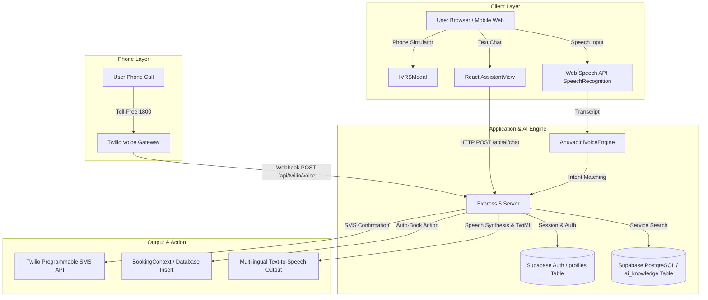

# Doorlyn 🚀
> **AI-Powered Multilingual Hyperlocal Service & Cloud Telephony Platform**

Doorlyn is a unified multi-service ecosystem designed to connect households across urban and rural India with everyday services—ranging from **healthcare & diagnostic home tests** to **home repairs, express parcel deliveries, house shifting, daily groceries, verified daily-wage workers, student tutors, and bulk event catering**—all accessible through a web app, a multilingual AI voice assistant, or real cloud telephony (Twilio IVR).

---

## 📋 Table of Contents

- [🌟 Key Features & Capabilities](#-key-features--capabilities)
- [🏥 Service Verticals & Offerings](#-service-verticals--offerings)
- [🤖 Multilingual AI & Cloud Telephony Architecture](#-multilingual-ai--cloud-telephony-architecture)
- [🛠️ Tech Stack](#️-tech-stack)
- [📁 Project Structure & Component Hierarchy](#-project-structure--component-hierarchy)
- [🗄️ Database Schema & Supabase Setup](#️-database-schema--supabase-setup)
- [📡 API Reference & Endpoints](#-api-reference--endpoints)
- [⚙️ Environment Variables](#️-environment-variables)
- [🚀 Getting Started & Local Setup](#-getting-started--local-setup)

---

## 🌟 Key Features & Capabilities

### 1. 🤖 Multilingual AI Voice & Chat Assistant
- **Voice & Text Capabilities**: Interactive conversational AI powered by **Anuvadini AI Engine** and browser-native **Web Speech API** (`SpeechRecognition` & `SpeechSynthesis`).
- **Context-Aware Multi-Turn Memory**: Remembers conversation history across turns, allowing users to ask follow-up questions about pricing, schedule modifications, or service inclusions without repeating context.
- **Intent Recognition & Action Dispatch**: Understands user requests (e.g., *"Book a CBC blood test for tomorrow"*, *"I need an electrician for fan repair"*, *"Deliver groceries in 15 mins"*) and automatically dispatches booking actions or populates forms.
- **Vernacular Language Support**: English (EN), Hindi (HI - हिंदी), and Telugu (TE - తెలుగు), with natural female Indian voice synthesis fallback.

### 2. 📞 Real Cloud Telephony & Interactive Voice Response (Twilio IVR)
- **Zero-Internet Service Booking**: Allows elderly, rural, or non-smartphone users to call a toll-free phone number (`1800-DOORLYN`) and book services via phone keypresses (DTMF) or voice prompts.
- **Automated TwiML Routing**: Dynamic voice menus generated by the Node.js/Express server that handle service selection, slot scheduling, address confirmation, and instant SMS confirmation dispatch.
- **In-App IVR Phone Call Simulation**: Includes an interactive in-app phone simulator modal (`IVRSModal.jsx`) to test IVR call flows directly from the browser interface.

### 3. 🏥 Digital Health Records Vault & AI Lab Interpretation
- **Medical History Vault**: Safely store diagnostic reports, prescriptions, and health checkup records.
- **AI Health Summarizer**: Reads complex lab reports (CBC, Fasting Blood Sugar, Lipid Profile) and generates easy-to-understand health summaries, normal range indicators, and lifestyle tips.

### 4. 📍 Real-Time Live Booking & Provider Tracking
- **Lifecycle Tracking**: Monitor active bookings through 4 key milestones: *Order Confirmed* → *Provider/Phlebotomist Assigned* → *En Route* → *Completed*.
- **Interactive Provider Cards**: View assigned partner details, star ratings, contact buttons, and estimated time of arrival (ETA).

### 5. 💰 Doorlyn Wallet & Referral System
- **Sign-up Bonus & Wallet**: New users receive ₹200 bonus credit upon registration.
- **Instant Refunds & Discount Coupons**: 100% free cancellation policy with instant wallet credits or bank refunds. Built-in promo codes (`FIRSTDOOR`, `HEALTH50`, `RURAL20`).

---

## 🏥 Service Verticals & Offerings

Doorlyn unifies 8 essential household service categories into a single platform:

| Vertical | Services Included | Key Pricing & Offerings |
| :--- | :--- | :--- |
| **1. Healthcare & Diagnostics** | Complete Blood Count (CBC), Fasting Sugar (FBS/PPBS), Lipid & Liver Profile, Master Health Checkup (68 parameters), Pregnancy Antenatal Checkup | • CBC: ₹349<br>• Blood Sugar: ₹149<br>• Master Health: ₹999<br>• Free phlebotomist home collection with 100% sterile sealed kits |
| **2. Home Repairs & Maintenance** | Electricians, Plumbers, Carpenters, AC Foam Jet Servicing, Appliance Repairs (Fridge, Washing Machine, RO Purifier) | • Electrician visit: ₹249<br>• Plumber visit: ₹199<br>• AC Foam Service: ₹499<br>• 30-day post-service warranty |
| **3. Express Pickup & Drop** | Local parcel delivery up to 5kg, documents, keys, tiffin boxes, laptops, retail packages | • Starts at ₹69<br>• 15-minute rider dispatch<br>• Weatherproof pouch & 4-digit security PIN handover |
| **4. Logistics & House Shifting** | 1BHK / 2BHK / 3BHK home relocation, office moving, mini truck hire (Tata Ace, Bolero) | • Starts at ₹2499<br>• Dedicated mini truck & loading helpers<br>• Multi-layer bubble wrapping & furniture dismantling |
| **5. Grocery & Daily Essentials** | Farm fresh vegetables, fruits, dairy (milk, curd), staples (rice, dal, oil, flour), snacks | • 15-minute express dark store delivery<br>• Free delivery above ₹149<br>• Daily veggie baskets from ₹199 |
| **6. Worker Marketplace** | Aadhaar-verified daily wage labor, senior masons (mestri), full home deep cleaning, water tank cleaning | • Daily Wage Labor: ₹600/day<br>• Senior Mason: ₹900/day<br>• Home Deep Cleaning: ₹1199<br>• Tank Cleaning: ₹599 |
| **7. Student Tutors & Services** | Primary tuition (Class 1-5), High School Maths/Science (Class 6-10), Intermediate MPC/BiPC, Epass/Govt scholarship form support | • Home Tutor: ₹2500/mo (or ₹299/hr)<br>• Online Live Tuition: ₹1500/mo<br>• Scholarship Form Assistance: ₹299 |
| **8. Food & Catering Services** | FSSAI certified event catering, wedding buffets, birthday party snack boxes, live counter setup | • Veg Buffet: ₹299/plate<br>• Non-Veg Biryani Feast: ₹450/plate<br>• Birthday Snack Combos: ₹249/plate |

---

## 🤖 Multilingual AI & Cloud Telephony Architecture



---

## 🛠️ Tech Stack

### Frontend Architecture
- **Framework**: React 19 + Vite 8
- **Styling**: Tailwind CSS v4, Lucide React Icons, Framer Motion
- **State Management**: React Context API (`AuthContext`, `BookingContext`, `CartContext`, `LanguageContext`)
- **Speech Engine**: Web Speech API (`SpeechRecognition` & `SpeechSynthesis`) + Anuvadini AI Voice Utilities
- **Effects**: Canvas Confetti

### Backend & Database Architecture
- **Server Runtime**: Node.js (ES Modules, `type: module`) + Express 5
- **Database & Authentication**: Supabase (`@supabase/supabase-js`, PostgreSQL, Row-Level Security policies)
- **Telephony & Messaging**: Twilio Node SDK & TwiML (Voice & SMS)
- **Development Tooling**: Concurrently, Oxlint

---

## 📁 Project Structure & Component Hierarchy

```
doorlyn/
├── server/                           # Express backend for Twilio IVR, AI API & Auth
│   └── index.js                      # Express server, Twilio TwiML webhooks & Supabase search
├── src/
│   ├── assets/                       # Images, icons, static assets
│   ├── components/                   # UI Components & Application Modals
│   │   ├── ai/                       # AI Assistant Widgets
│   │   │   ├── BookingConfirmationCard.jsx # Auto-booking card widget inside chat
│   │   │   ├── ProviderCard.jsx           # Service provider detail widget inside chat
│   │   │   └── VoiceStatusIndicator.jsx   # Animated mic wave indicator
│   │   ├── BookingModal.jsx          # Comprehensive 3-step checkout modal
│   │   ├── BottomNav.jsx             # Mobile bottom navigation bar
│   │   ├── HealthRecordModal.jsx     # Medical records upload & viewing modal
│   │   ├── IVRSModal.jsx             # Interactive Twilio IVR phone simulator modal
│   │   ├── LiveTrackingModal.jsx     # Provider live GPS ETA tracking modal
│   │   ├── Navbar.jsx                # Top header navigation bar & language selector
│   │   └── ServiceCard.jsx           # Service listing card with quick book action
│   ├── context/                      # React State Contexts
│   │   ├── AuthContext.jsx           # User authentication, profile & wallet balance
│   │   ├── BookingContext.jsx        # Active bookings & tracking state
│   │   ├── CartContext.jsx           # 15-Min Express Grocery cart state
│   │   └── LanguageContext.jsx       # Global language state (EN, HI, TE)
│   ├── data/                         # Static fallback datasets & translations
│   │   ├── servicesData.js           # 8 core service categories & pricing tariffs
│   │   └── translations.js           # Multilingual dictionary (EN, HI, TE)
│   ├── lib/                          # External libraries
│   │   └── supabaseClient.js         # Supabase client initialization
│   ├── services/                     # Service layer & tools
│   │   ├── aiKnowledgeService.js     # Supabase ai_knowledge database query helper
│   │   ├── aiProvider.js             # High-level AI assistant handler
│   │   └── doorlynTools.js           # AI tool execution dispatcher
│   ├── utils/                        # Core Utilities
│   │   ├── anuvadiniAI.js            # Anuvadini Voice Engine & speech synthesis
│   │   └── searchHelper.js           # Client-side fuzzy search helper
│   ├── views/                        # Main Screen Views
│   │   ├── AssistantView.jsx         # Multilingual Voice & Text AI Chatbot
│   │   ├── AuthView.jsx              # Login & Registration screen
│   │   ├── BookingsView.jsx          # User active & historical booking list
│   │   ├── GroceryView.jsx           # 15-Min Express Grocery store interface
│   │   ├── HomeView.jsx              # Landing page & service category hub
│   │   └── ProfileView.jsx           # User profile, wallet & health records vault
│   ├── App.jsx                       # Root application component & route controller
│   └── main.jsx                      # Application entry point
├── supabase_schema.sql               # Database setup, tables, RLS policies & seed data
├── .env.example                      # Environment variables template
├── package.json                      # Project configuration & npm scripts
└── vite.config.js                    # Vite bundler configuration
```

---

## 🗄️ Database Schema & Supabase Setup

The database schema is defined in [`supabase_schema.sql`](file:///C:/Users/srich/OneDrive/Desktop/doorlyn/supabase_schema.sql) and includes:

### Tables Overview

1. `public.profiles`: Stores user profiles, addresses, referral codes, and wallet balances.
   - Primary Key: `id` (UUID references `auth.users`)
   - Fields: `name`, `phone`, `email`, `address`, `wallet_balance` (default 200.00), `referral_code`, `is_phone_verified`.
   - Security: Row-Level Security (RLS) restricts access to the owning user (`auth.uid() = id`).
   - Trigger: `handle_new_user()` auto-populates `profiles` upon Supabase Auth sign-up.

2. `public.ai_knowledge`: Multilingual knowledge base powering the AI Assistant search.
   - Fields: `category`, `service_id`, `title`, `question`, `answer`, `language` ('EN', 'HI', 'TE'), `keywords` (text array), `price`, `metadata` (JSONB).
   - Indexes: GIN index on `keywords`, B-Tree indexes on `language`, `category`, and `service_id`.
   - Security: Public SELECT policy enabled for lightning-fast assistant responses.

3. `public.bookings` *(Client/Backend synced)*: Records service reservations.
   - Fields: `id` (e.g. `DLN-89421`), `serviceCategory`, `serviceName`, `date`, `timeSlot`, `patientName`, `totalAmount`, `status`, `assignedProvider`, `trackingSteps`.

4. `public.health_records`: Digital health records vault.
   - Fields: `id`, `title`, `date`, `lab`, `findings`, `aiExplanation`, `downloadUrl`.

---

## 📡 API Reference & Endpoints

### 🔑 Authentication Endpoints

#### `POST /api/auth/register`
Creates a new user account and initializes wallet credit.
```json
// Request Body
{
  "identifier": "user@doorlyn.in",
  "password": "securepassword",
  "name": "Ananya Sharma"
}

// Response (200 OK)
{
  "success": true,
  "user": {
    "id": "usr-1740000000",
    "name": "Ananya Sharma",
    "email": "user@doorlyn.in",
    "walletBalance": 200
  },
  "token": "jwt-token-usr-1740000000"
}
```

#### `POST /api/auth/login`
Authenticates existing users.

---

### 🤖 AI Assistant Endpoint

#### `POST /api/ai/chat`
Processes multilingual user messages, scans history context, queries Supabase AI knowledge, and returns responses with optional auto-booking actions.
```json
// Request Body
{
  "message": "I want to book a blood test for tomorrow morning",
  "language": "EN",
  "history": [
    { "role": "user", "content": "Hi" },
    { "role": "assistant", "content": "How can I help you today?" }
  ],
  "address": "Flat 402, Lotus Heights, Hitech City, Hyderabad"
}

// Response (200 OK)
{
  "reply": "🏥 Doorlyn Healthcare & Diagnostics: CBC Test is ₹349 including free home sample collection. Would you like to confirm for tomorrow 8:00 AM?",
  "options": ["Yes, Book Now", "View Lab Options"],
  "suggestedAction": {
    "type": "AUTO_BOOK",
    "bookingData": {
      "serviceCategory": "Healthcare & Diagnostic",
      "serviceName": "Full Body CBC & Sugar Checkup",
      "date": "2026-08-04",
      "timeSlot": "08:00 AM - 09:00 AM",
      "totalAmount": 349,
      "paymentMethod": "Cash / UPI on Collection"
    }
  }
}
```

---

### 📞 Cloud Telephony (Twilio IVR Webhooks)

| Endpoint | Method | Description |
| :--- | :--- | :--- |
| `/api/twilio/voice` | `POST` | TwiML voice entry point triggered when a user dials the Doorlyn Twilio number. Plays initial welcome message in requested language and presents keypress options. |
| `/api/twilio/gather-intent` | `POST` | Processes user keypresses (DTMF `Digits`) or speech transcript (`SpeechResult`) from the IVR menu, looks up service information, and speaks details. |
| `/api/twilio/confirm-booking` | `POST` | Finalizes IVR service booking, generates a booking ID, and sends an SMS confirmation to the caller's phone. |
| `/api/twilio/trigger-call` | `POST` | Triggers an outbound automated IVR voice call to a specified phone number for service notifications. |
| `/api/twilio/status` | `GET` | Returns real-time Twilio integration status and configuration state. |

---

## ⚙️ Environment Variables

Create a `.env` file in the project root based on `.env.example`:

```env
# Twilio Real Cloud Telephony Credentials
TWILIO_ACCOUNT_SID=your_twilio_account_sid
TWILIO_AUTH_TOKEN=your_twilio_auth_token
TWILIO_PHONE_NUMBER=+1234567890

# Anuvadini AI API Key (Optional for fallback)
ANUVADINI_API_KEY=your_anuvadini_api_key

# Supabase Credentials
VITE_SUPABASE_URL=https://your-supabase-project.supabase.co
VITE_SUPABASE_ANON_KEY=your_supabase_anon_key

# Express Server Port
PORT=3000
```

| Variable | Description | Required? |
| :--- | :--- | :--- |
| `TWILIO_ACCOUNT_SID` | Twilio Account SID from Twilio Console | Optional (Required for real IVR calls) |
| `TWILIO_AUTH_TOKEN` | Twilio Auth Token | Optional (Required for real IVR calls) |
| `TWILIO_PHONE_NUMBER` | Purchased Twilio Phone Number | Optional |
| `VITE_SUPABASE_URL` | Supabase Project URL | Recommended |
| `VITE_SUPABASE_ANON_KEY` | Supabase Anonymous Key | Recommended |
| `PORT` | Backend Express server port (default `3000`) | Optional |

---

## 🚀 Getting Started & Local Setup

### Prerequisites

- **Node.js**: `v18.0.0` or higher
- **npm**: `v9.0.0` or higher
- **Supabase Account**: (Free tier at [supabase.com](https://supabase.com))
- **Twilio Account**: *(Optional, for testing real phone calls)*

### Step-by-Step Setup

1. **Clone the Repository**:
   ```bash
   git clone https://github.com/sricharanreddy2/doorlyn.git
   cd doorlyn
   ```

2. **Install Dependencies**:
   ```bash
   npm install
   ```

3. **Configure Environment Variables**:
   ```bash
   cp .env.example .env
   ```
   Fill in your Supabase credentials in `.env`.

4. **Initialize Supabase Database**:
   - Open your Supabase Dashboard → **SQL Editor**.
   - Paste the full contents of [`supabase_schema.sql`](file:///C:/Users/srich/OneDrive/Desktop/doorlyn/supabase_schema.sql).
   - Click **Run** to generate tables, RLS security policies, triggers, and seed data.

5. **Run the Application**:

   - **Option A: Run Frontend & Express Server Simultaneously (Recommended)**:
     ```bash
     npm run start:all
     ```
     - Frontend URL: `http://localhost:5173`
     - Backend URL: `http://localhost:3000`

   - **Option B: Run Independently**:
     ```bash
     # Terminal 1: Run Vite Frontend
     npm run dev

     # Terminal 2: Run Express Backend
     npm run server
     ```
